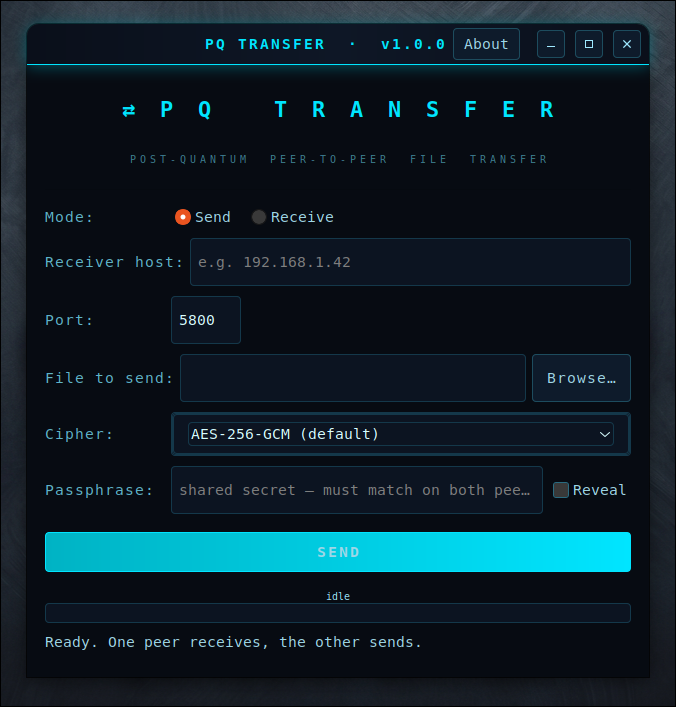

<div align="center">

<a href="https://github.com/effjy/pqtransfer/"></a>

**Send a file directly from one machine to another over an end-to-end
encrypted, post-quantum channel — no server, no cloud, no account.**

<a href="https://github.com/effjy/pqtransfer/releases"></a>
<a href="https://github.com/effjy/pqtransfer"></a>
<a href="https://github.com/effjy/pqtransfer"></a>
<a href="https://github.com/effjy/pqtransfer"></a>
<a href="https://github.com/effjy/pqtransfer"></a>
<a href="https://github.com/effjy/pqtransfer"></a>
<a href="https://github.com/effjy/pqtransfer"></a>

<br>



</div>

---

## What it is

PQ Transfer is a small GTK3 desktop tool that moves a file **peer-to-peer**.
One side **receives** (listens on a port); the other **sends** (connects to
it). The two negotiate a fresh session key with a hybrid **Kyber-1024 + X448**
key agreement, then stream the file under an authenticated cipher
(**AES-256-GCM**, **XChaCha20-Poly1305** or **ChaCha20-Poly1305**). An optional
shared passphrase authenticates the channel and defeats man-in-the-middle
tampering.

It reuses the cryptographic core of
[Ciphers](https://github.com/effjy/ciphers) — the same hybrid KEM and AEAD
framing — applied to a live socket instead of a file on disk.

---

## Features

- **Direct peer-to-peer TCP transfer** — one sender, one receiver, nothing in between.
- **Post-quantum hybrid key agreement** (Kyber-1024 + X448): the session key
  stays secure as long as *either* primitive holds.
- **Authenticated ciphers**: AES-256-GCM (default), XChaCha20-Poly1305 or
  ChaCha20-Poly1305.
- **Optional shared passphrase** via a real **CPace PAKE** (over Ristretto255):
  authenticates the channel with *no offline dictionary attack* — an attacker
  gets at most one online guess per connection, even for a short passphrase.
- **Chunked, authenticated streaming** — per-chunk tags detect tampering,
  reordering and truncation; a bad transfer fails instead of writing a corrupt file.
- **Hardened memory** — passphrases and keys live in `libsodium` locked,
  non-dumpable memory and never hit swap; core dumps are disabled.
- **No overwrite** — the receiver auto-renames to `name (1)`, `name (2)`, …

---

## Prerequisites

PQ Transfer needs GTK 3, libsodium, libargon2 and OpenSSL (libcrypto), plus a
C compiler, `make` and `pkg-config`.

**Debian / Ubuntu / Mint**
```sh
sudo apt install build-essential pkg-config \
    libgtk-3-dev libsodium-dev libargon2-dev libssl-dev
```

**Fedora / RHEL**
```sh
sudo dnf install gcc make pkgconf-pkg-config \
    gtk3-devel libsodium-devel libargon2-devel openssl-devel
```

**Arch / Manjaro**
```sh
sudo pacman -S base-devel gtk3 libsodium argon2 openssl
```

---

## Build

```sh
git clone https://github.com/effjy/pqtransfer.git
cd pqtransfer
make
```

This produces the `./pqtransfer` binary. Run it directly with `./pqtransfer`.

---

## Install

To install system-wide (binary, icon, and an application-menu entry):

```sh
sudo make install
```

The window/taskbar icon appears once installed. To remove everything:

```sh
sudo make uninstall
```

By default it installs under `/usr/local`; override with `PREFIX`, e.g.
`sudo make install PREFIX=/usr`.

---

## Usage

PQ Transfer is symmetric: one machine receives, the other sends. **Start the
receiver first.**

### On the receiving machine

1. Choose **Receive**.
2. Leave *Listen on* blank (all interfaces) or enter a specific local IP.
3. Pick the **port** (default `5800`) and the **folder** to save into.
4. Optionally type a **passphrase**.
5. Click **RECEIVE** — it now waits for the sender.

### On the sending machine

1. Choose **Send**.
2. Enter the receiver's **host / IP** and the same **port**.
3. Pick the **file** to send and the **cipher** (AES-256-GCM by default).
4. Enter the **same passphrase**.
5. Click **SEND**.

A live progress bar shows the transfer; **CANCEL** aborts at any time. When it
finishes, the receiver reports the saved path.

> **Networking note.** This is a direct TCP connection (IPv4 and IPv6; the
> receiver listens dual-stack). On a LAN or VPN it just works. Across the
> internet, the receiver must be reachable on the chosen port
> (port-forwarding / firewall rule).

---

## How it works

```
  RECEIVER (listens)                         SENDER (connects)
  ──────────────────                         ─────────────────
  generate Kyber-1024 + X448 keypair
  CPace: pick Yb from (passphrase, sid)
        │   HELLO:  magic | sid | Yb | public key
        ├──────────────────────────────────────────►
        │                          encapsulate → KEM secret
        │                          CPace: pick Ya from (passphrase, sid)
        │   magic | cipher | Ya | KEM ciphertext | nonce
        ◄──────────────────────────────────────────┤
  decapsulate → KEM secret                          │
        │   both: ISK = CPace(Ya, Yb)               │
        │   channel key = H(ISK; KEM secret, Ya, Yb)│
        │   AEAD frame 0: filename + size           │
        ◄──────────────────────────────────────────┤
        │   AEAD frames 1..n: file in 64 KiB chunks │
        ◄──────────────────────────────────────────┤
  write file, verify final frame
```

The channel key binds **both** the post-quantum KEM secret **and** a
[CPace](https://datatracker.ietf.org/doc/draft-irtf-cfrg-cpace/) PAKE keyed by
the passphrase. It stays secret if **either**:

* the hybrid KEM holds — post-quantum confidentiality against *any* passive
  eavesdropper; or
* the passphrase is unknown to an active attacker — CPace gives mutual
  authentication, and because its messages are independent of the passphrase
  there is **no offline dictionary attack**: a man-in-the-middle gets only one
  online guess per connection, then derives a different key and fails the first
  authentication tag.

With an **empty** passphrase, CPace degrades to a plain ephemeral DH: you still
get confidentiality against passive eavesdroppers (from the KEM), but no
authentication — so **set a passphrase whenever the path between peers is
untrusted.** A short, memorable shared word is enough; CPace does the rest.

---

## Security scope

PQ Transfer protects data **in transit** between two endpoints you control. It
is not an anonymity tool — the two IP addresses see each other.

---

## Changelog

### v1.0.1

Bug-fix and hardening release — no wire-protocol changes; v1.0.0 peers
interoperate.

- **Hardened** the libsodium-backed secure passphrase buffer: it now zeroes the
  unused tail of its guarded allocation on every edit, so a typed-then-cleared
  passphrase no longer lingers in locked memory until the widget is freed, and
  guards its capacity growth against an integer overflow on a pathological paste.
- **Durability:** the receiver now `fsync`s the received file and its parent
  directory before/after the atomic rename, so a crash or power loss cannot
  publish a truncated file as a completed transfer.
- **Robustness:** the receiver now rejects empty, non-final content frames,
  so a misbehaving peer can no longer keep it looping indefinitely on frames
  that never advance toward the declared file size.

---

## License

MIT © 2026 Jean-Francois Lachance-Caumartin
